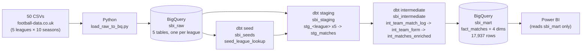

# Sports Betting Intelligence Platform

## Live demo:https://haodata.github.io/football-betting-analytics-pipeline/

Enterprise-style ELT pipeline for football/sports-betting analytics, built as a
portfolio project targeting data engineering / sports-betting analytics roles.
**Phase 1 (pipeline) and Phase 2 (tests/docs) are complete and verified end-to-end
against live BigQuery.** No ML yet (Phase 3 — see Roadmap).

Data: 50 CSVs from [football-data.co.uk](https://www.football-data.co.uk/), 5 leagues
(Premier League, Bundesliga, La Liga, Serie A, Ligue 1) × 10 seasons each (2016/17
through 2025/26) — 17,937 matches total.


## Skills demonstrated

- **Cloud data warehousing**: BigQuery raw/staging/intermediate/mart layering, schema
  evolution across heterogeneous source files (`ALLOW_FIELD_ADDITION`), region-aware
  dataset design.
- **dbt / analytics engineering**: layered star-schema modeling, reusable doc blocks,
  generic + singular tests, custom macros (`generate_schema_name`, date parsing,
  season derivation), package dependencies (`dbt_utils`).
- **Python data engineering**: idiomatic `google-cloud-bigquery` ingestion, defensive
  handling of real-world CSV inconsistencies (BOM, illegal column characters, dtype
  drift), structured logging and per-file error isolation.
- **SQL**: CTE-driven transformations, window functions for leakage-safe rolling
  team-form features, `SAFE_DIVIDE`/`SAFE_CAST` for robust numeric handling.
- **Sports-betting domain knowledge**: odds-implied probability, bookmaker overround
  (margin), and betting-relevant feature engineering (rolling form) layered on top of
  the core match-analytics model CLAUDE.md specifies.
- **Data quality investigation**: found and documented 3 real defects in the source
  data before they could silently corrupt the pipeline (see "Known data quirks" below).

## Architecture



Verified state: `dbt run` builds all 14 models successfully; `dbt test` passes all 115
tests (generic column tests across every model's now-complete column documentation,
plus 2 singular business-invariant tests and `accepted_range` checks added in
Phase 2); `fact_matches` row count (17,937) matches the sum of all 5 raw tables'
row counts exactly.

## One-time setup

1. **Python environment**
   ```
   cd sports-betting-intelligence/ingestion
   python -m venv .venv && .venv\Scripts\activate
   pip install -r requirements.txt
   ```
2. **Config**: copy `.env.example` to `.env` (in this project's root) and fill in
   `GCP_PROJECT_ID`. `DATA_SOURCE_DIR` already points at the Desktop CSV folder.
3. **Credentials**: either set `GOOGLE_APPLICATION_CREDENTIALS` to a service-account
   key file, or reuse an existing `gcloud` Application Default Credentials login (both
   are picked up automatically by `google-cloud-bigquery` and dbt's `method: oauth`).
4. **BigQuery datasets** (one-time; pick a region consistent with any other datasets
   in the same project — this build uses `EU`):
   ```
   bq mk --dataset --location=EU <project>:sbi_raw
   bq mk --dataset --location=EU <project>:sbi_seeds
   bq mk --dataset --location=EU <project>:sbi_staging
   bq mk --dataset --location=EU <project>:sbi_intermediate
   bq mk --dataset --location=EU <project>:sbi_mart
   bq mk --dataset --location=EU <project>:sbi_dbt
   ```
5. **dbt**: `pip install dbt-bigquery`, then add a `sports_betting_intelligence`
   profile to `~/.dbt/profiles.yml` following `dbt/profiles.yml.example` (that file
   stays a template — the real `profiles.yml` lives outside the repo, alongside any
   other projects' profiles you already have).

## Running the pipeline

```
# 1. Load raw CSVs into BigQuery
python sports-betting-intelligence/ingestion/load_raw_to_bq.py

# 2. Build the dbt project
cd sports-betting-intelligence/dbt
dbt deps
dbt debug
dbt seed
dbt run
dbt test
dbt docs generate && dbt docs serve
```

## Verification

- Raw row counts confirmed exact: Premier League/La Liga/Serie A = 3,800 each
  (10 × 380), Bundesliga = 3,060 (10 × 306, 18-team league), Ligue 1 = 3,477
  (reflects the COVID-shortened 2019/20 season and the 2023/24 reduction to 18 teams).
- `dbt test`: 115/115 passing, including two singular business-invariant tests added in
  Phase 2 (`assert_goal_totals_match`, `assert_result_flags_mutually_exclusive`) and
  `dbt_utils.accepted_range` checks on implied-probability columns.
- Every column across all 14 models now has a `description` (via reusable
  `` blocks in `dbt/models/docs.md`) — check `dbt docs generate` output.
- Spot check: Man United 1–0 Fulham, 16/08/2024 (`E0 2425.csv`), confirmed end-to-end
  through `fact_matches`: `match_result = 'Home Win'`, `home_points = 3`,
  `total_goals = 1`, `bookmaker_overround ≈ 0.054`, and the pre-match rolling form
  columns reflect only matches before this one (no result leakage).

## Known data quirks (verified against all 50 source files)

- Column count per file ranges 61–132 (bookmaker odds columns added over time, plus
  some column names contain characters BigQuery field names can't hold, e.g.
  `B365>2.5` — sanitized by `ingestion/load_raw_to_bq.py` without touching values).
  The 22 core match-stat columns and `B365H/D/A` odds are present in all 50 files.
- `Referee` only exists in Premier League files; `Time` only exists from the 2019/20
  season onward (all leagues). Both handled as nullable in staging.
- Date format is `DD/MM/YY` through the 2017/18 season and `DD/MM/YYYY` from 2018/19
  onward — handled by `dbt/macros/parse_match_date.sql`.
- **`D1 1617.csv` and `D1 1718.csv` are swapped**: `D1 1617.csv` actually contains
  2017/18 season matches and `D1 1718.csv` contains 2016/17 matches. This does not
  break the pipeline because `season` is derived from `match_date`, never from the
  filename — but it's worth knowing if you inspect the raw files directly.

## Roadmap

Phase 1 (pipeline) ✅ and Phase 2 (tests/docs, this README) ✅ are done. Next:

- **Phase 3**: ML trained only from `sbi_mart` — match result / over-2.5 / BTTS
  prediction, using the odds-implied-probability and rolling-form columns already
  present in `fact_matches` as features.
- **Phase 4**: swap CSV for a live football API, same downstream architecture.
- **Phase 5**: Cloud Scheduler automation (ingestion → dbt build → Power BI refresh).

See root `CLAUDE.md` for the full original roadmap and layer-by-layer rules this
project follows.
